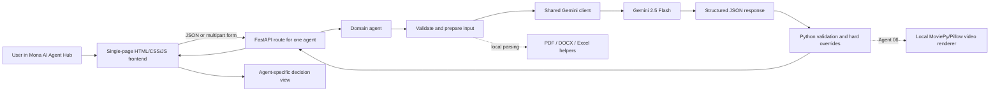

# Mona AI: 10-Minute Architecture and Demo Mental Model

## The one-sentence explanation

Mona AI is a **single operational cockpit for ten focused AI workflows**: a browser sends text or documents to FastAPI, a domain agent combines deterministic Python rules with Gemini's interpretation, and the UI turns the resulting JSON into a decision-oriented view for a human reviewer.

The most important idea is this:

> **Gemini handles ambiguity; Python owns certainty.**

We use Gemini where the task requires understanding language, documents, images, intent, or context. We use normal code for rules that must never drift: eligibility, price limits, allowed labels, security blocks, date handling, and mandatory human review.

## The architecture in one picture

Think of the system as three roles:

1. **Interpreter:** Gemini understands messy human input and documents.
2. **Referee:** Python enforces business, safety, and compliance rules.
3. **Presenter:** The frontend makes the output scannable and actionable.

## How a request actually moves

1. The user opens the Agent Hub and selects one of ten workflows.
2. The frontend builds the right input form from a small agent registry. File agents send `multipart/form-data`; text agents send JSON.
3. FastAPI validates required fields and delegates to exactly one domain module under `agents/`.
4. The agent performs local preparation where useful: parsing Excel, extracting DOCX tables, truncating long text, or screening for injection phrases.
5. The shared `GeminiClient` sends either text or file bytes to Gemini 2.5 Flash and requests JSON output with a low temperature of `0.2`.
6. `clean_json_response()` removes occasional Markdown fences and parses the model response into a Python dictionary.
7. The agent checks or overwrites unsafe values. Examples: prices are clamped, unknown departments become `Other`, confidence is bounded, and sensitive HR decisions require review.
8. FastAPI returns JSON. The frontend chooses a renderer for that agent: risk gauge, document checklist, ranked staff list, pricing comparison, batch panels, or video preview.

There is no database or user session. Request data lives in memory and disappears after the response. The one deliberate exception is Agent 06: generated MP4 previews are cached under `frontend/static/videos/` so the browser can play and download them.

## Why the project is shaped this way

### 1. One hub instead of ten separate apps

All ten problems share navigation, upload behavior, loading states, errors, export, and visual language. A single frontend avoids duplicating that shell and makes the demo feel like one product rather than ten disconnected prototypes.

The tradeoff is a large `index.html`. That is acceptable for a hackathon because deployment is nearly zero-config and iteration is fast. In production, the registry, forms, and renderers would move into components and routes.

### 2. Vertically independent agents on a shared platform

Each folder contains `agent.py` for orchestration and `prompts.py` for model instructions. This gives every use case its own boundary while sharing configuration, the Gemini wrapper, and JSON helpers.

This is a useful compromise: agents can evolve independently, but a model change, API-key change, or response-format change has one shared integration point. FastAPI dynamically imports each agent and installs a fallback stub if a module is unavailable, so one unfinished workflow does not prevent the whole demo server from starting.

### 3. Prompts are configuration, not hidden business logic

Prompts live outside the agent functions so they are readable, reviewable, and adjustable without mixing wording changes into routing code. Each prompt asks for an exact JSON shape. That gives the UI a predictable contract and avoids showing raw model prose.

The model contract is currently enforced by prompting plus parsing, not by Pydantic or JSON Schema validation. That was a speed-conscious prototype decision; strict schemas and retry logic are a clear production upgrade.

### 4. Hybrid AI beats “let the model decide everything”

The strongest example is Shift Replacement. Python reads the workbook and applies six non-negotiable rules: role, certifications, active status, scheduled day off, adequate rest, and weekly-hours capacity. Gemini sees only the eligible candidates, then ranks tie-breakers and drafts the contact message.

That separation gives us both strengths: reproducible policy enforcement and flexible communication. It also makes the system explainable: we can say exactly why a person was eligible before AI ranked them.

The same pattern appears elsewhere:

- **Invoice:** Gemini extracts and routes; Python validates departments and forces review above EUR 10,000.
- **Pricing:** Gemini reasons about market signals; Python enforces `+25%` and `-40%` bounds and requires approval beyond a `15%` change.
- **Secure Email:** code screens known attacks and derives document completeness; Gemini classifies isolated documents and summarizes safely.
- **Analytics and Gap Analysis:** Gemini finds patterns; Python bounds numerical confidence and predicted lift.

### 5. Human review is a product feature

Recruitment, immigration documents, fraud analysis, and high-value financial actions should not become automatic decisions just because a model returns a confident answer. Sensitive agents therefore surface confidence, reasons, flags, and review gates instead of pretending to be an authority.

This is reflected in both layers: backend overrides such as `human_review_required = True`, and frontend elements such as warning banners, risk colors, confidence views, and recommended actions.

### 6. Statelessness was chosen for speed and privacy

No database means no migration, account model, retention job, or accidental long-term store of uploaded HR documents. It makes local setup and GDPR reasoning simpler for the prototype.

The tradeoff is that there is no history, audit trail, collaboration, or resumable workflow. A production version would store only necessary metadata, encrypt it, define deletion policies, add access controls, and establish a DPA and regional model-processing policy.

### 7. The UI is optimized for decisions, not model output

The UI never treats generic JSON as the finished experience. Each agent has a purpose-built renderer:

- batch documents become sortable, expandable result panels;
- fraud becomes a risk gauge and recommendation;
- permits become a decision plus confidence and flags;
- pricing becomes old-versus-new price with signal weights and guardrails;
- secure email becomes a red/green security state and four-document checklist;
- shift replacement becomes a ranked call order and ready-to-send message.

This design reduces cognitive load during a demo and in repeated operational use. The dark, dense cockpit aesthetic, fixed sidebar, restrained department colors, compact type, and responsive layout reinforce that this is a work tool, not a marketing landing page.

## The ten agents: what AI does versus what code owns

| # | Workflow | Gemini's job | Deterministic/system job |
|---|---|---|---|
| 01 | Invoice routing | Extract fields, line items, category, and routing reason | Parse DOCX text and tables; validate department; force high-value review; isolate batch failures |
| 02 | Shift replacement | Rank already-eligible staff and draft outreach | Parse Excel; apply all six eligibility rules; validate roster/date; attach trusted phone data; require review |
| 03 | Work permit | Read document image/PDF and assess validity | Validate MIME type; use current date; always require human review; fail batch items safely |
| 04 | CV/certificate fraud | Detect inconsistencies and tampering indicators | Normalize enums and fields; always require human review; treat failures as high risk |
| 05 | Interview support | Generate role-specific technical and behavioral questions | Validate and truncate the job description; present an HR review notice |
| 06 | Marketing content | Create hook, scenes, CTA, safe-zone brief, and warnings | Supply fallback platform specs; render and cache a vertical MP4 locally |
| 07 | Customer analytics | Infer segments, timing, channels, and targeting signals | Accept aggregated data only; cap predicted lift at 50%; normalize arrays and date |
| 08 | Dynamic pricing | Interpret weather, event, demand, and supply signals | Clamp price to 60%-125% of base; recalculate percentage; require approval above 15%; set expiry |
| 09 | Gap analysis | Find market white space and rank product opportunities | Limit prompt size and clamp confidence to 0-1 |
| 10 | Secure email | Classify each document in isolation and summarize the email | Extract text; pre-screen body and attachments; block known injection patterns; calculate document completeness from trusted labels |

## Best demo storyline

Do not try to run all ten agents. Show the hub, then use three agents to prove three different design ideas.

### 0:00-0:45 - Frame the product

Say:

> “Mona AI is one operational hub for ten business workflows across HR, healthcare operations, finance, and marketing. The shared architecture is intentionally simple, but each agent has its own safety boundary and decision view.”

Point out the searchable grid, customer-specific workflows, common status language, and sidebar. Explain that the UI shell is shared while the workflow logic stays independent.

### 0:45-3:15 - Agent 02: prove the hybrid architecture

Upload the schedule and run a shift replacement. Explain that Gemini is **not** allowed to invent eligibility. Python reads the workbook and filters against the six rules first. Only then does Gemini rank eligible people and draft a human-friendly message.

Key sentence:

> “We put policy in code and judgment at the model boundary.”

### 3:15-5:45 - Agent 10: prove security by design

Run the clean application scenario, then the email-injection or attachment-injection scenario. Show that the malicious case is blocked before the main summarization flow.

Explain the layers: lexical pre-screen, isolated attachment classification, code-derived document checklist, and a main prompt that receives classified labels rather than raw attachment contents.

Key sentence:

> “Untrusted documents are treated as data, never as instructions.”

### 5:45-7:30 - Agent 08 or 06: prove business value

Choose Agent 08 for a governance-focused audience. Enter a base price and strong demand signal, then show how the result explains signal weights and exposes any guardrail or approval requirement.

Choose Agent 06 for a visually focused audience. Generate a campaign brief and show the playable vertical MP4. Explain that Gemini creates the creative structure while deterministic local rendering turns it into a tangible asset and respects platform geometry.

### 7:30-9:00 - Explain the reusable architecture

Return to the hub and summarize the shared flow: input form, FastAPI route, domain agent, shared Gemini client, JSON contract, hard validation, custom renderer. Mention that adding another agent means adding a module, prompt, route, registry entry, form, and renderer without redesigning the platform.

### 9:00-10:00 - Close with deliberate tradeoffs

Say:

> “For the hackathon, we optimized for clear boundaries, privacy, and demo speed: one deployable service, no database, and low operational overhead. For production, the next layer is authentication, strict response schemas, audit logging, asynchronous workers, and governed persistence.”

## Five-minute pre-demo check

1. Activate `.venv`, confirm `.env` contains the Gemini key, and run `make run`.
2. Open `http://localhost:8000/health` and confirm `{"status":"ok"}`.
3. Keep internet access available for Gemini, Google Fonts, and the SheetJS Excel parser.
4. Run the exact Agent 02 and Agent 10 inputs you plan to show; model output and latency can vary.
5. If showing Agent 06, generate the video once before presenting so its cached MP4 is ready.

## Likely questions and strong answers

**Why Gemini 2.5 Flash?**  
The workflows need multimodal document understanding and fast structured generation. Flash gives a good latency/capability tradeoff for an interactive prototype, and the shared client lets us change the model centrally.

**Why not use AI for every decision?**  
Because policy should be deterministic. The model handles interpretation and ranking; code enforces limits, eligibility, trusted labels, and mandatory review.

**How do you reduce hallucinations?**  
We ask for narrow JSON contracts, use low temperature, validate enums and ranges, override critical fields in code, pre-filter source data, and expose confidence and review gates.

**Is it GDPR compliant?**  
It is privacy-oriented, not production-certified. Inputs are not stored in a database or logged as prompt content, but production still needs legal review, a DPA, access control, regional processing decisions, retention enforcement, and auditability.

**Can one broken agent crash the platform?**  
Agent imports are guarded and missing modules receive a not-ready stub. Batch document agents also isolate failures per file, so one corrupt document does not discard the rest of the batch.

**What would you change for production?**  
Add Pydantic request/response models, JSON Schema model output, retries and timeouts, background workers for Gemini and video rendering, authentication and role-based access, encrypted object storage, audit events, rate limits, file-size enforcement, malware scanning, observability, and automated tests.

## What is genuinely prototype-level today

- Gemini and video work run synchronously inside request handlers, so long jobs can block server capacity.
- Output dictionaries are shaped by prompts and partial checks, not full runtime schemas.
- There is no authentication, authorization, rate limiting, malware scanning, or durable audit trail.
- `MAX_FILE_SIZE_MB` and `DATA_RETENTION_DAYS` exist in configuration but are not actively enforced by middleware or storage jobs.
- The browser API base is fixed to `localhost:8000`, and Excel validation depends on SheetJS loaded from a CDN.
- Generated marketing videos persist on disk, unlike the uploaded request data.
- The Gemini integration uses the deprecated `google.generativeai` SDK and should migrate to `google.genai`.
- Automated test coverage is limited; Agent 10 has manual scenario tests, while the broader suite needs unit tests with a mocked model client.

These are not accidental omissions to hide. They are the boundary between a focused hackathon prototype and a production platform.

## Final memory hook

If you remember only five things, remember these:

1. **One hub, ten independent vertical agents.**
2. **Gemini interprets; Python enforces.**
3. **Prompts produce contracts, not chatty prose.**
4. **Sensitive outputs support humans rather than replace them.**
5. **The prototype is stateless by default, simple to run, and designed to show a credible path to production.**
